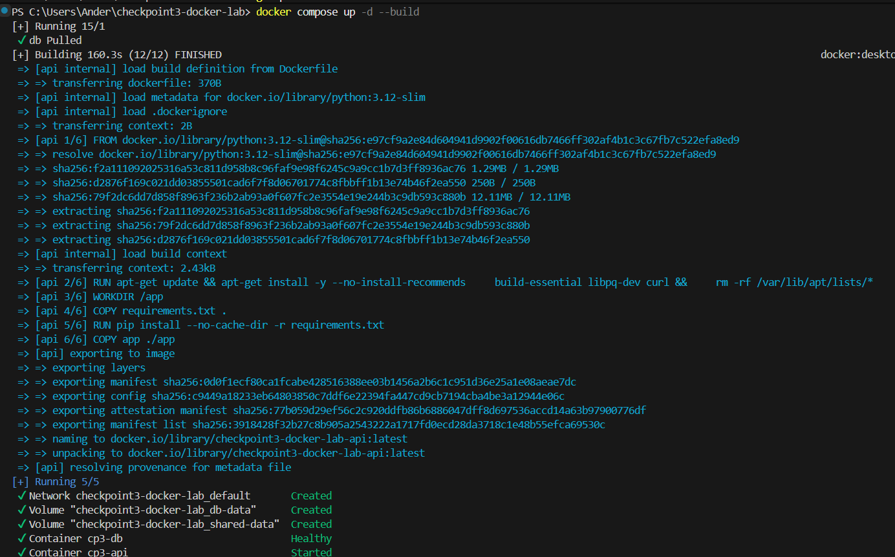
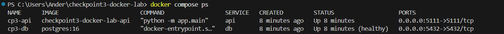
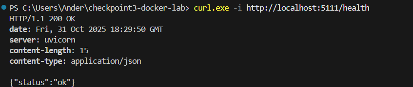
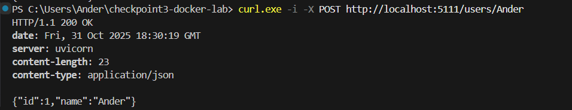
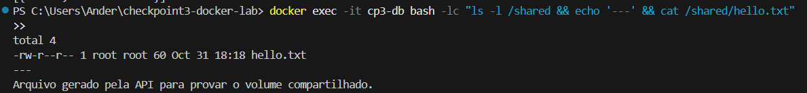

# Checkpoint 3 – DevOps Tools & Cloud Computing (2TDSPS-2025)

Laboratório Docker com:
- API (FastAPI) + Banco (PostgreSQL)
- Mesma rede Docker
- Volume **compartilhado** entre **ambos** os containers
- Orquestração via `docker-compose.yml`
- Dockerfile para API
- Instruções claras (abaixo)

## Pré-requisitos
- Docker / Docker Desktop instalado e rodando

## Como executar (passo a passo)
```bash
# 1) clonar o repositório
git clone https://github.com/AnderKamada/checkpoint3-docker-lab.git
cd checkpoint3-docker-lab

# 2) (opcional) revisar credenciais em .env

# 3) subir tudo
docker compose up -d --build

# 4) ver status
docker compose ps
docker compose logs -f api   # Ctrl+C p/ sair
docker compose logs -f db

# 5) Prints
#### Containers rodando no Docker Desktop


#### Saída do `docker compose ps`


#### Healthcheck da API


#### POST /users e GET /users


#### Prova do volume compartilhado (hello.txt)

